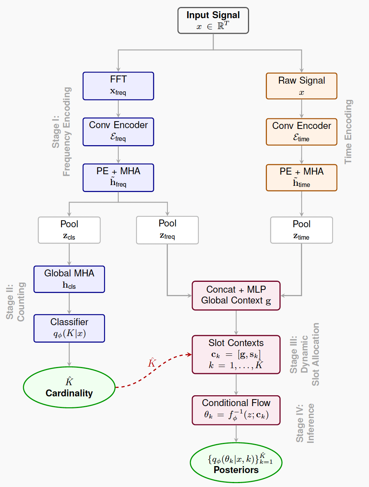
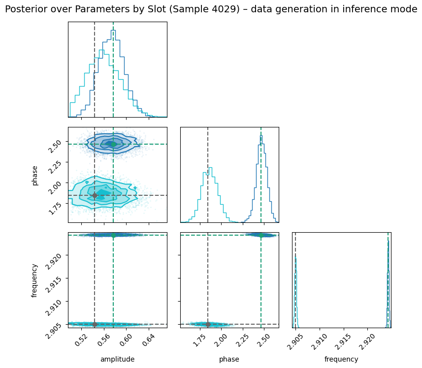
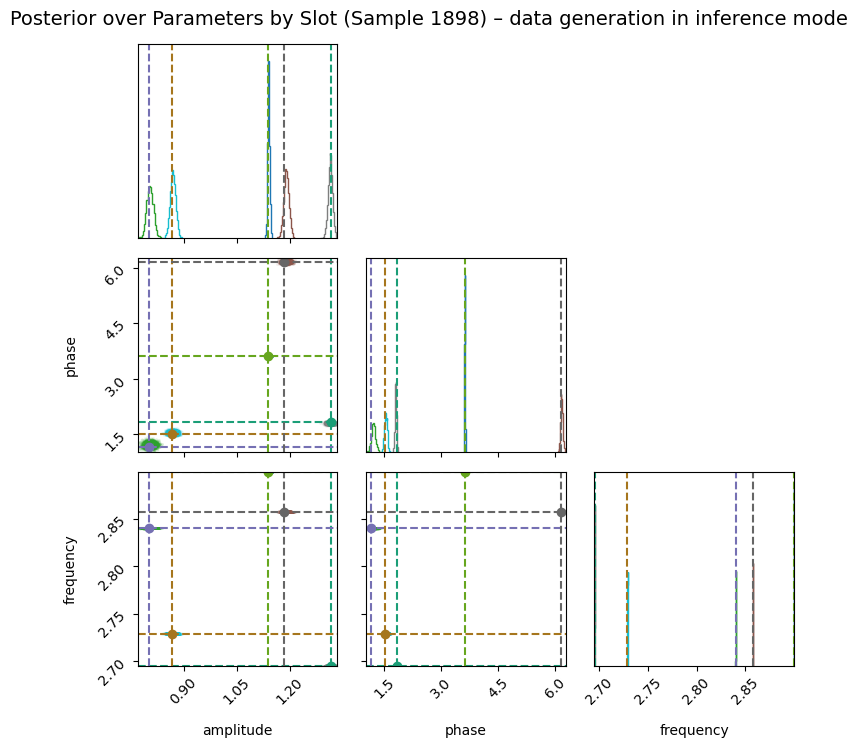
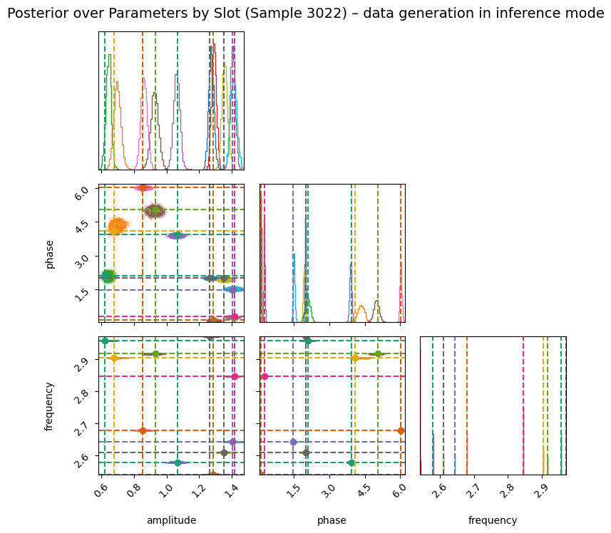

# SlotFlow

<table>
<tr>
<td style="width: 220px; vertical-align: middle;">
  
</td>
<td style="vertical-align: middle; padding-left: 20px;">

A deep learning framework for amortized trans-dimensional inference using slot-based conditional normalizing flows.

</td>
</tr>
</table>

## Description

We propose SlotFlow, an amortized inference framework for decomposing signals into sinusoidal components when the number of sources is unknown. The model jointly infers both the cardinality $\hat{K}$ and per-component parameters through three core innovations:

1. **Dual-Stream Encoding**: Parallel frequency- and time-domain encoders extract complementary spectral and temporal features, achieving O(K) computational scaling
2. **Dynamic Slot Allocation**: Instantiates exactly $\hat{K}$ slots based on cardinality prediction, avoiding wasted capacity
3. **Permutation-Invariant Training**: Hungarian-matched conditional normalizing flows with phase weighting enable robust posterior estimation

The architecture processes time-series observations, predicts a distribution over component counts $q_\phi(K | x)$, and parameterizes per-slot marginal posteriors $q_\phi(\theta_k | x, k)$ using shared rational-quadratic spline flows. Rather than modeling the full joint posterior over all parameters and sources, the method approximates a factorized posterior with shared global context, enabling interpretable and modular inference while capturing inter-component dependencies.

## Installation

To use the codes in this repository, create an environment:

```bash
conda create -n slotflow python=3.12 matplotlib pytorch scipy jupyter
conda activate slotflow
```

---

## Observation Model

We assume the observed signal $x(t) \in \mathbb{R}^T$ is generated as a mixture of $K$ latent sinusoidal components:

$$
x(t) = \sum_{k=1}^{K} a_k \cos(2\pi f_k t + \phi_k) + \epsilon(t), \quad \epsilon(t) \sim \mathcal{N}(0, \sigma^2)
$$

where $\theta_k = (a_k, \phi_k, f_k)$ denotes the parameters of the $k$-th component.

---

## Bayesian Goal

Infer the posterior over $K$ and parameters $\Theta = \{\theta_1, \dots, \theta_K\}$ given $x(t)$:

$$
p(K, \Theta \mid x) = \frac{p(x \mid \Theta, K) p(\Theta \mid K) p(K)}{p(x)}
$$

**Likelihood**: Assuming additive Gaussian noise,

$$
p(x \mid \Theta, K) = \prod_{t=1}^T \mathcal{N}\left(x_t \mid \sum_{k=1}^K a_k \cos(2\pi f_k t + \phi_k), \sigma^2\right)
$$

---

## Amortized Posterior Approximation

We learn a classifier $\hat{K}(x)$ and conditional flows to approximate:

$$
p(\theta_k \mid x, k) \approx q_\phi(\theta_k \mid c_k)
$$

with $c_k$ a slot-specific context vector combining global embeddings with orthogonal slot identifiers. The learned posterior factorizes approximately:

$$
p(\Theta \mid x, K) \approx \prod_{k=1}^{K} q_\phi(\theta_k \mid c_k)
$$

where shared global context $g$ induces dependencies: $q_\phi(\theta_i, \theta_j \mid x) = \int q_\phi(\theta_i| g, i) q_\phi(\theta_j | g, j) q_\phi(g | x) \, dg$.

---

## Training Objective

**Total Loss**:

$$
L = L_{\text{cls}} + L_{\text{flow}} + \gamma \cdot L_{\text{noise}}
$$

**Classification Loss**:

$$
L_{\text{cls}} = \text{CrossEntropy}(\hat{K}(x), K_{\text{true}})
$$

**Flow Loss with Hungarian Matching**: Let $\sigma$ be the optimal slot-component assignment:

$$
L_{\text{flow}} = -\frac{1}{B} \sum_b \frac{1}{K_b} \sum_k \log q_\phi(\theta_k^{(b)} \mid c_{\sigma(k)}^{(b)})
$$

**Noise Supervision Loss**: Parallel encoder predicts log noise level $\log \hat{\sigma}$:

$$
L_{\text{noise}} = \text{MSE}(\log \hat{\sigma}, \log \sigma_{\text{true}})
$$

---

## Reconstruction

Posterior samples enable per-slot signal reconstruction:

$$
\hat{x}(t) = \sum_{k=1}^{\hat{K}} \hat{a}_k \cos(2\pi \hat{f}_k t + \hat{\phi}_k)
$$

where $(\hat{a}_k, \hat{\phi}_k, \hat{f}_k) \sim q_\phi(\theta_k | c_k)$.

---

## Model Architecture

<p align="center">
  
</p>

The architecture operates in four stages:

1. **Dual-Stream Encoding**: Frequency pathway processes FFT representations, time pathway processes raw signals, both refined via positional encoding and multi-head attention
2. **Cardinality Estimation**: Frequency features undergo global self-attention and pooling to produce $q_\phi(K | x)$
3. **Slot Context Generation**: Global context $g$ (fused frequency-time embeddings) is concatenated with one-hot slot identifiers: $c_k = [g, s_k]$
4. **Conditional Flow Inference**: Shared 8-layer rational-quadratic spline flow produces per-slot posteriors $q_\phi(\theta_k | x, k)$

---

## Example Outputs

<h4 align="center">Slot posteriors for K = 2</h4>
<p align="center">
  
</p>

<h4 align="center">Slot posteriors for K = 5</h4>
<p align="center">
  
</p>

<h4 align="center">Slot posteriors for K = 10</h4>
<p align="center">
  
</p>

---

## Key Results

- **Cardinality Accuracy**: 99.85% on test set with K ∈ {1,...,10}
- **Posterior Quality**: Wasserstein distances W₂ < 0.01 (amplitude), < 0.03 (phase), 0.0006 (frequency) vs. RJMCMC
- **Calibration**: < 3% absolute bias across all parameters and cardinalities
- **Speed**: 13 ms inference time (1.5×10⁶× speedup over RJMCMC for the paper's example cases)
- **Scalability**: O(K) computational cost with embarrassingly parallel slot inference

---

## Repository Structure

```
SlotFlow/
├── README.md
├── media/
│   └── (example figures, etc.)
├── pretrained_model/
│   └── (model configuration and model weights)
├── slurm/
│   └── (job scripts & logs)
├── src/
│   ├── dataset.py
│   ├── loss.py
│   ├── model.py
│   ├── utils.py
│   └── wrapper.py
├── Eval.ipynb
├── Train-cluster.py

```

---

## Quick Start

- Run Inference: To load a pretrained SlotFlow model and perform cardinality estimation or posterior sampling, simply open and execute Eval.ipynb. It demonstrates: loading the pretrained checkpoint predicting the number of components K sampling posteriors and reconstructing signals.
- Train a New Model: To train SlotFlow from scratch with custom settings, run Train-cluster.py. For large-scale training, we recommend launching it on an HPC cluster using the SLURM batch scripts provided in the slurm/ directory.
Cluster-specific adjustments (paths, modules, partitions, GPUs) may be required.

Download the pretrained SlotFlow model from the release page:

https://github.com/nhouba/slotflow-inference/releases/latest

Or download directly:

```bash
wget https://github.com/nhouba/slotflow-inference/releases/download/v1.0.0/best_model.ckpt
```

---

## Future Directions

- Multi-scale encoders with fine/coarse-stride branches for improved frequency precision
- Time-frequency representations (wavelets, STFT) for non-stationary signals
- Graph neural networks for explicit inter-slot dependencies
- Application to gravitational-wave astronomy (LISA data) and neural spike sorting

---

## References

[1] Locatello, F., Weissenborn, D., Unterthiner, T., Mahendran, A., Heigold, G., Uszkoreit, J., Kipf, T., & Dosovitskiy, A. (2020). [Object-Centric Learning with Slot Attention](https://arxiv.org/abs/2006.15055). *NeurIPS*.

[2] Houba, N. (2025). *Deep source separation of overlapping gravitational‑wave signals and nonstationary noise artifacts*. Phys. Rev. Research. [https://doi.org/10.1103/6bjw‑xjj2](https://doi.org/10.1103/6bjw-xjj2).

[3] Houba, N., Giarda, G., & Speri, L. (2025). *SlotFlow: Amortized Trans-Dimensional Inference with Slot-Based Normalizing Flows*. [Paper Link](https://github.com/nhouba/slotflow-inference).

---

## Citation

If you use SlotFlow in your research, please cite:

```bibtex
@article{houba2025slotflow,
  title={SlotFlow: Amortized Trans-Dimensional Inference with Slot-Based Normalizing Flows},
  author={Houba, Niklas and Giarda, Giovanni and Speri, Lorenzo},
  journal={arXiv preprint},
  year={2025}
}
```

---

## License

This project is licensed under the MIT License - see the LICENSE file for details.

---

## Contact

For questions or issues, please contact:
- Niklas Houba: nhouba@phys.ethz.ch

---

## Acknowledgements

This research was funded by the Gravitational Physics Professorship at ETH Zurich. Computational resources provided by the Euler Cluster at ETH Zurich and the Clariden supercomputer at CSCS through the Swiss AI Initiative (Grant SIGMA-GW).
