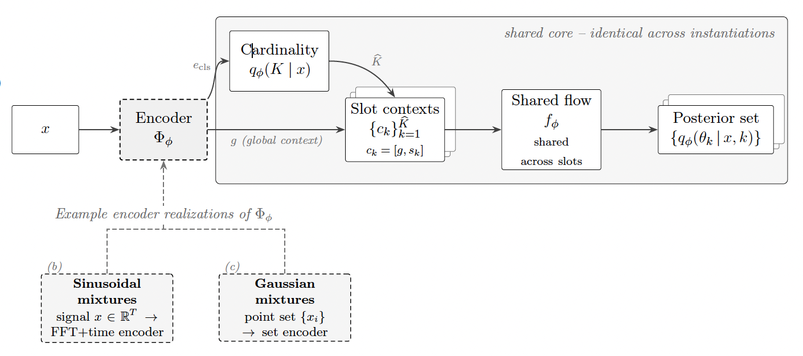

# SlotFlow

<table>
<tr>
<td style="width: 220px; vertical-align: middle;">
  
</td>
<td style="vertical-align: middle; padding-left: 20px;">

A general framework for **amortized trans-dimensional inference**: jointly inferring the number of latent components in an observation *and* their parameters, in a single forward pass, using slot-based conditional normalizing flows.

</td>
</tr>
</table>

## Overview

Many inference problems are *trans-dimensional*: the number of latent components `K` is itself unknown, so the parameter space changes dimension with `K`. Classical samplers (reversible-jump MCMC, sequential Monte Carlo) are asymptotically exact but must be rerun per dataset and scale poorly with `K`; amortized neural posterior estimators are fast but assume a fixed parameter dimension and delegate model-order selection to a separate step.

**SlotFlow** infers the cardinality and the per-component parameters jointly. Its core is **modality-agnostic** — an application enters only through a choice of encoder and a component parameterization:

1. **Cardinality head** — an encoder maps the observation `x` to a global context `g` and a classification embedding `e_cls`; a softmax head produces a posterior `q(K | x)` over the component count.
2. **Dynamic slot allocation** — exactly `K̂` slots are instantiated (`K̂` the MAP estimate), each with context `c_k = [g, s_k]` (global embedding + a slot identifier). Inference cost is therefore `O(K̂)`.
3. **Shared conditional flow** — a single conditional normalizing flow, shared across slots, parameterizes each per-component posterior `q(θ_k | c_k)`.
4. **Permutation-invariant training** — a Hungarian-matched objective makes both the loss and the resulting set-valued posterior invariant to relabeling the components.

<p align="center">
  
</p>

## Instantiations

The same inference core is reused unchanged across two qualitatively different generative families; only the encoder and the component transform change.

- **Sinusoidal mixtures** (`src/`) — additive signals `x(t) = Σ_k a_k cos(2π f_k t + φ_k) + ε(t)`. A dual-stream encoder processes a frequency-domain (FFT) view and a time-domain view; each component is `θ_k = (a_k, φ_k, f_k)`.
- **Gaussian mixtures** (`src/gmm/`) — unordered 2-D point sets drawn from a `K`-component Gaussian mixture. A permutation-invariant Set-Transformer encoder maps the point set to `(g, e_cls)`; each component is `θ_k = (μ_k, log σ_k)`.

## Key results

- **Sinusoidal mixtures.** Cardinality is recovered correctly in ~99.85% of held-out signals, and the amortized posteriors closely match reference reversible-jump MCMC at a fraction of the cost, with near-constant inference time across `K`.
- **Gaussian mixtures.** On a deliberately overlapping regime, SlotFlow yields posteriors competitive with a Gibbs reference and **more accurate component counts than a per-cardinality neural posterior estimator** (0.558 vs. 0.497), using a single forward pass and roughly a third of the baseline's parameters.

Together, these show that one common SlotFlow inference core transfers across distinct trans-dimensional problems.

## Repository structure

```
slotflow-inference/
├── src/
│   ├── core.py            # shared framework core: conditional flow, slot contexts, Hungarian matching
│   ├── model.py           # sinusoidal SlotFlow (dual-stream encoder)
│   ├── dataset.py         # sinusoidal data generation
│   ├── wrapper.py         # training wrapper (sinusoidal)
│   ├── loss.py            # Hungarian-matched flow loss
│   ├── utils.py           # inference / plotting utilities
│   ├── eval/
│   │   └── metrics.py     # cardinality accuracy, calibration, posterior-fidelity metrics
│   └── gmm/               # Gaussian-mixture instantiation
│       ├── model.py
│       ├── encoder.py     # Set-Transformer / Deep-Sets encoders
│       ├── dataset.py
│       └── wrapper.py
├── baselines/
│   ├── npe_per_k.py       # per-cardinality neural posterior estimator + model-selection head
│   └── reference_gmm.py   # classical reference: Gibbs sampler + BIC model selection
├── Train-cluster.py       # train sinusoidal SlotFlow
├── Train-GMM.py           # train Gaussian-mixture SlotFlow
├── Train-NPE.py           # train the NPE-per-K baseline
├── Eval-GMM.py            # evaluate the Gaussian-mixture benchmark (SlotFlow vs. NPE vs. reference)
├── Eval.ipynb             # sinusoidal inference demo
├── validate_reference.py  # sanity-check the Gaussian-mixture reference sampler
└── media/                 # figures
```

## Installation

```bash
conda create -n slotflow python=3.12
conda activate slotflow
pip install torch pytorch-lightning nflows scipy numpy matplotlib jupyter
```

## Quick start

**Sinusoidal mixtures.** Open and run `Eval.ipynb` to load a pretrained model and perform cardinality estimation, posterior sampling, and signal reconstruction. To train from scratch:

```bash
python Train-cluster.py --out_dir results_sin --max_K 10
```

**Gaussian mixtures.** Train SlotFlow and the baselines, then evaluate the cross-domain benchmark:

```bash
python Train-GMM.py --out_dir results_gmm --k_max 10 --encoder set_transformer
python Train-NPE.py --out_dir results_npe --k_max 10 --encoder set_transformer
python Eval-GMM.py \
    --slotflow_ckpt results_gmm/checkpoints/last.ckpt \
    --npe_ckpt      results_npe/checkpoints/last.ckpt \
    --k_max 10 --encoder set_transformer
```

For large-scale training we recommend an HPC cluster; cluster-specific adjustments (paths, modules, partitions, GPUs) may be required.

## Pretrained model

Download the pretrained sinusoidal SlotFlow model from the release page:

https://github.com/nhouba/slotflow-inference/releases/latest

```bash
wget https://github.com/nhouba/slotflow-inference/releases/download/v1.0.0/best_model.ckpt
```

## Citation

If you use SlotFlow in your research, please cite:

```bibtex
@misc{houba2025slotflowamortizedtransdimensionalinference,
      title={SlotFlow: Amortized Trans-Dimensional Inference with Slot-Based Normalizing Flows},
      author={Niklas Houba and Giovanni Giarda and Lorenzo Speri},
      year={2025},
      eprint={2511.23228},
      archivePrefix={arXiv},
      primaryClass={astro-ph.IM},
      url={https://arxiv.org/abs/2511.23228},
}
```

## License

This project is licensed under the MIT License — see the [LICENSE](LICENSE) file for details.

## Contact

For questions or issues, please contact:
- Niklas Houba: nhouba@phys.ethz.ch

## Acknowledgements

This research was funded by the Gravitational Physics Professorship at ETH Zurich. Computational resources were provided by the Euler Cluster at ETH Zurich and the Clariden supercomputer at CSCS through the Swiss AI Initiative.
